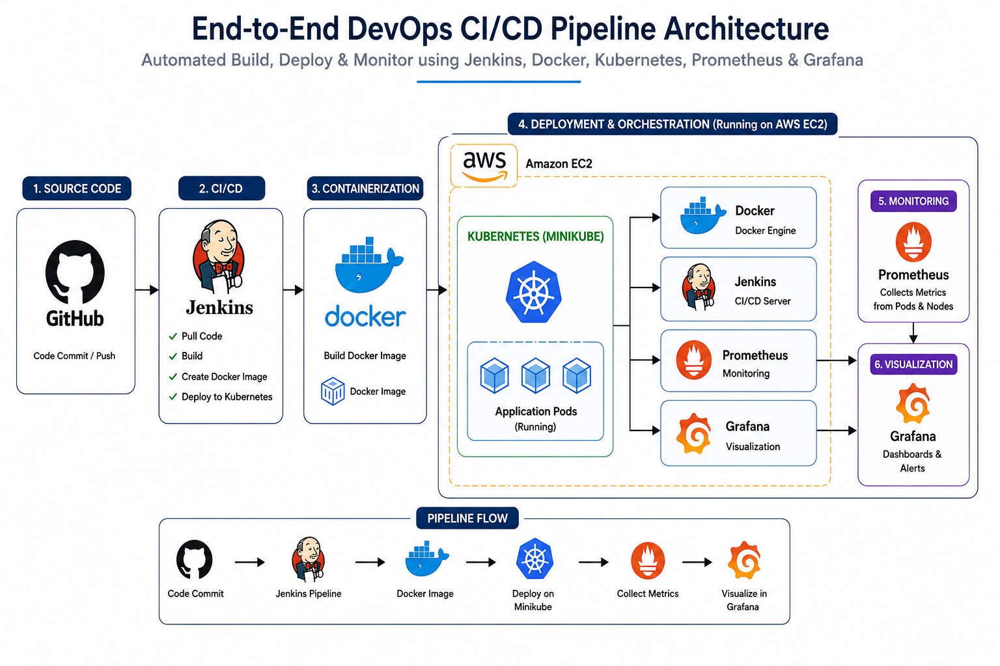
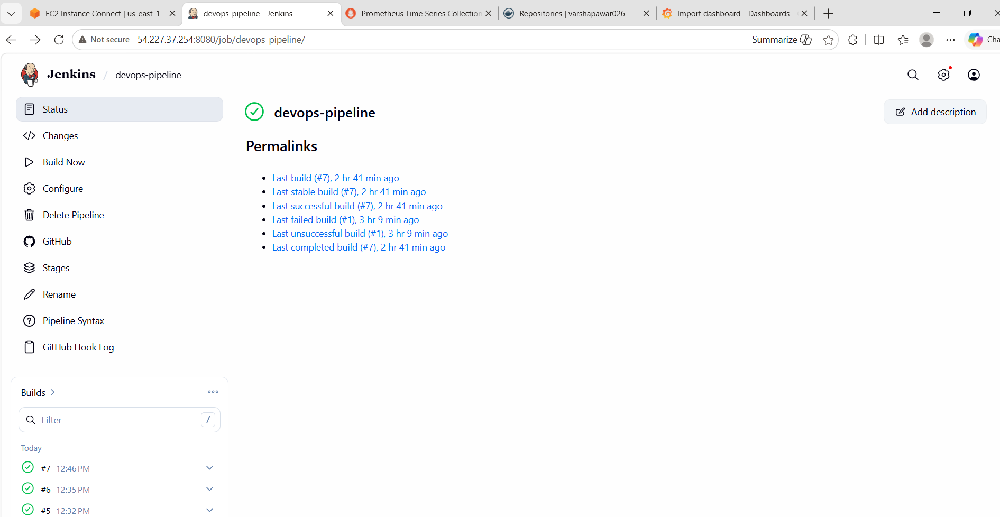
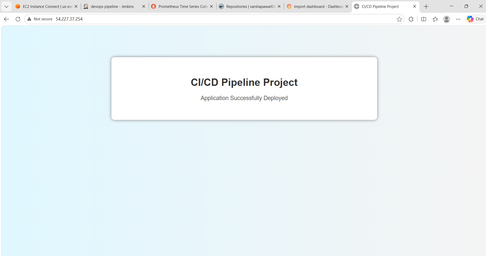
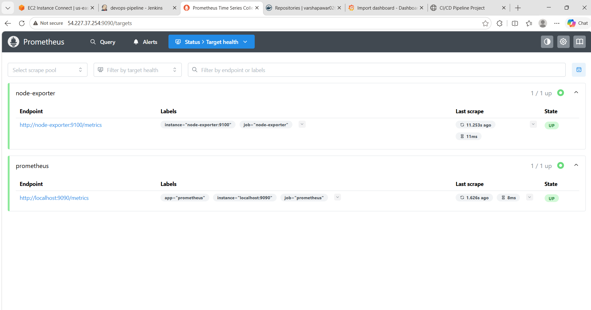
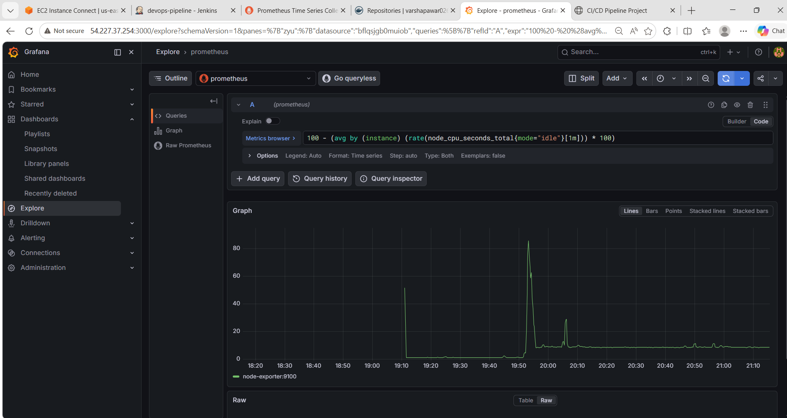

# 🚀 End-to-End DevOps Pipeline with Docker & Monitoring

### GitHub → Jenkins → Docker → Kubernetes → Prometheus → Grafana

Automated CI/CD pipeline with containerized deployment and real-time monitoring on AWS EC2.

---

## 🏗️ Architecture
<p align="left">
  
</p>

---

## ⚡ What I Built

✅ Automated CI/CD Pipeline using Jenkins

✅ Dockerized Application Deployment

✅ Kubernetes (Minikube) Integration

✅ AWS EC2 Hosting

✅ Real-Time Monitoring with Prometheus

✅ Grafana Dashboard Visualization

---

## 🛠️ Tech Stack

| Category         | Technology            |
| ---------------- | --------------------- |
| Source Control   | GitHub                |
| CI/CD            | Jenkins               |
| Containerization | Docker                |
| Orchestration    | Kubernetes (Minikube) |
| Monitoring       | Prometheus            |
| Visualization    | Grafana               |
| Cloud            | AWS EC2               |

---

## 🔄 Workflow

GitHub → Jenkins → Docker Build → Kubernetes Deployment → Prometheus → Grafana

---

## 📸 Project Screenshots

### Jenkins Pipeline

<p align="left">
  
</p>

### Application Running

<p align="left">
  
</p>
### Prometheus Monitoring

<p align="left">
  
</p>

### Grafana Dashboard

<p align="left">
  
</p>

---

## 📂 Project Structure

```text
devops-project/
│
├── index.html
├── Dockerfile
├── Jenkinsfile
├── k8s-deployment.yaml
├── k8s-service.yaml
├── README.md
│
└── screenshots/
```

---

## 🎯 Key Learning

Built a complete DevOps workflow covering CI/CD automation, containerization, Kubernetes deployment, monitoring, and cloud-based application management.
